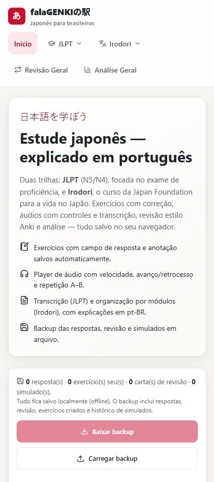
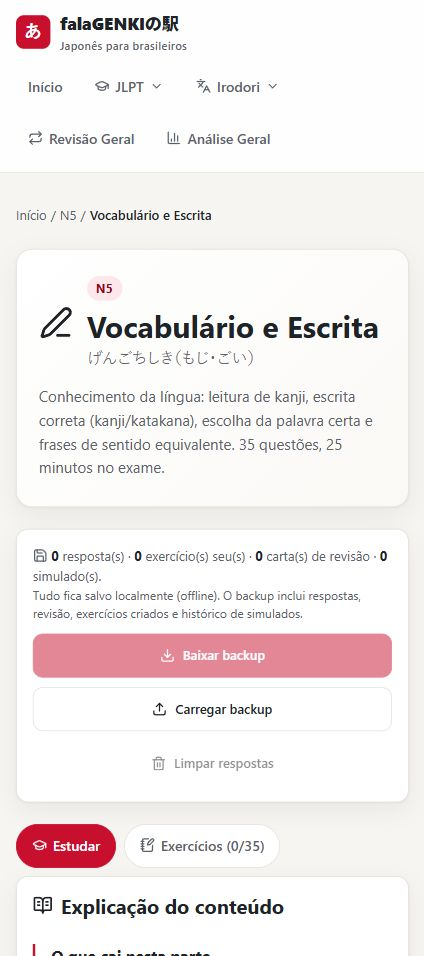
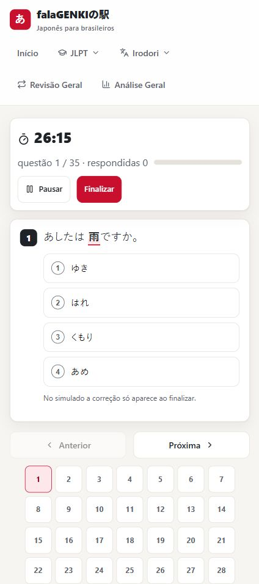
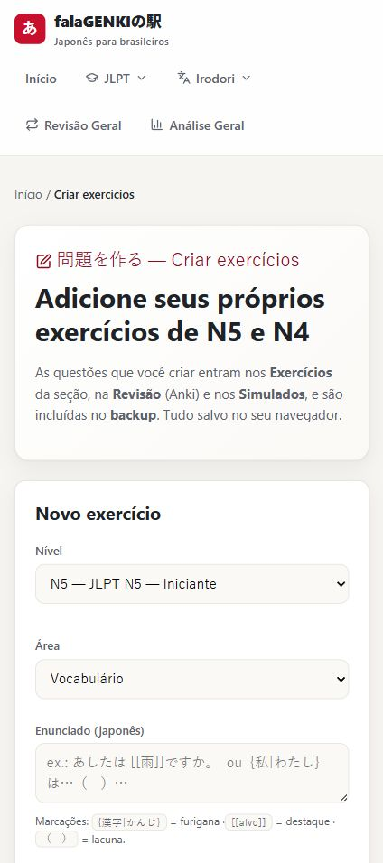

# falagenki-station | falaGENKIの駅

Personal Japanese study platform built with React, Vite, and TypeScript.

## Navigation

- [Screenshots](#screenshots)
- [English (US)](#english-us)
- [日本語 (JP)](#japanese-jp)
- [Português (PT-BR)](#portuguese-pt-br)
- [Technical Notes](#technical-notes)
- [Local Development](#local-development)

## Screenshots

The current UI has been checked against an iPhone 16 Pro Max viewport and smaller mobile widths.









<a id="english-us"></a>

## English (US)

**falaGENKIの駅** is a personal, non-commercial Japanese study platform created for my own learning routine. The goal was not to build a product to sell. The goal was to solve a real study problem I had, while also practicing frontend engineering, content modeling, UI design, local persistence, deployment, and mobile compatibility.

Although it started as a personal tool, the project is intentionally practical. It shows how a real user need can become structured data, product flows, responsive UI, local persistence, deployment, validation, and ongoing iteration.

### What It Does

- Organizes JLPT and Irodori study material into levels, sections, exercises, audio, scripts, review, and analytics.
- Provides interactive exercises with answer checking, explanations in Brazilian Portuguese, notes per question, and automatic local saving.
- Includes audio study flows with playback speed, seeking, A-B looping, script viewing, furigana, and translation.
- Adds an Anki-style review queue using local spaced repetition data.
- Includes timed mock exams, attempt history, per-question timing analysis, and review handoff for wrong answers.
- Lets the user create custom JLPT exercises locally and include them in study, review, backup, and mock exam flows.
- Works as a static SPA with no backend requirement. Progress is stored in `localStorage` and can be exported/imported as JSON.

### Current Status

- Production build runs through Vite and TypeScript.
- Deployment workflow uses Cloudflare Pages direct upload via Wrangler.
- SPA fallback is handled through `public/_redirects`.
- The mobile layout was recently optimized around iPhone 16 Pro Max dimensions, with checks across 440px, 390px, and 320px wide viewports.
- The project remains personal and non-commercial, but it is written and organized as a serious application because the engineering practice is part of the purpose.

### Engineering Highlights

- TypeScript data modeling for lessons, levels, questions, audio tracks, and script items.
- Local-first persistence for answers, custom exercises, SRS state, and exam history.
- Structured rendering for Japanese text with local conventions:
  - `{漢字|かんじ}` for furigana
  - `[[target]]` for highlighted exam targets
  - `（　）` for blanks
- Browser-router SPA deployment with Cloudflare Pages fallback.
- Responsive CSS tuned for touch targets, long Japanese strings, study cards, forms, audio controls, and timed exam navigation.
- No external AI or translation API is required at runtime.

<a id="japanese-jp"></a>

## 日本語 (JP)

**falaGENKIの駅** は、自分自身の日本語学習のために作った、個人用かつ非商用の学習プラットフォームです。販売やサービス化を目的にしたものではありません。自分の学習上の課題を解決しながら、フロントエンド開発、データ設計、UI設計、ローカル保存、デプロイ、モバイル対応などを実践するために作っています。

個人用途から始まったプロジェクトですが、実際の利用シーンを前提に丁寧に作っています。学習コンテンツを構造化し、使いやすい画面に落とし込み、検証しながら改善していくプロセスも、このプロジェクトの重要な目的です。

### 主な機能

- JLPT と Irodori の教材を、レベル、セクション、問題、音声、スクリプト、復習、分析に整理。
- 問題演習、解答チェック、ブラジルポルトガル語での解説、問題ごとのメモ、自動ローカル保存。
- 音声学習: 再生速度、シーク、A-Bリピート、スクリプト表示、ふりがな、翻訳。
- Anki 形式に近い復習キューと、ローカルの間隔反復データ。
- 模擬試験、履歴、問題ごとの時間分析、間違えた問題の復習への送信。
- 自分で JLPT 問題を作成し、学習、復習、バックアップ、模擬試験に統合。
- バックエンド不要の静的SPA。進捗は `localStorage` に保存し、JSONでエクスポート、インポート可能。

### 現在の状態

- Vite と TypeScript による本番ビルドが可能。
- Cloudflare Pages と Wrangler の direct upload でデプロイ。
- `public/_redirects` により SPA の deep link に対応。
- iPhone 16 Pro Max を主な基準としてモバイルレイアウトを調整し、440px、390px、320px 幅でも検証済み。
- 個人用、非商用のままですが、実践的な開発力を示すため、アプリケーションとして丁寧に作っています。

### 技術的なポイント

- レベル、問題、音声、スクリプトなどの TypeScript データモデル。
- 回答、独自問題、復習状態、模擬試験履歴をローカル優先で保存。
- 日本語テキストの構造化レンダリング:
  - `{漢字|かんじ}` はふりがな
  - `[[target]]` は強調表示
  - `（　）` は空欄
- Cloudflare Pages で動く browser-router SPA。
- 長い日本語、タッチ操作、音声プレイヤー、フォーム、試験ナビゲーションを意識したレスポンシブCSS。
- 実行時に外部AI APIや翻訳APIは不要。

<a id="portuguese-pt-br"></a>

## Português (PT-BR)

**falaGENKIの駅** é uma plataforma pessoal de estudos de japonês, criada a partir das minhas próprias necessidades. A intenção não é comercializar o projeto. A intenção é ter uma ferramenta real para estudar melhor e, ao mesmo tempo, colocar em prática técnicas de programação, organização de dados, frontend, UX, persistência local, deploy e compatibilidade mobile.

Mesmo sendo pessoal, o projeto foi tratado como uma aplicação de verdade. Ele mostra como uma dor real pode virar um produto utilizável, com conteúdo estruturado, fluxo de estudo, experiência mobile e validação antes de considerar uma mudança pronta.

### O Que Ele Faz

- Organiza conteúdos de JLPT e Irodori por níveis, seções, exercícios, áudios, scripts, revisão e análise.
- Oferece exercícios interativos com correção, explicação em português do Brasil, anotação por questão e salvamento automático.
- Traz estudo por áudio com velocidade, avanço/retrocesso, repetição A-B, transcrição, furigana e tradução.
- Inclui revisão estilo Anki com dados de repetição espaçada salvos localmente.
- Inclui simulados cronometrados, histórico, análise de tempo por questão e envio das erradas para revisão.
- Permite criar exercícios próprios de JLPT e integrá-los ao estudo, revisão, backup e simulados.
- Funciona como SPA estático, sem backend obrigatório. O progresso fica no `localStorage` e pode ser exportado/importado em JSON.

### Situação Atual

- Build de produção com Vite e TypeScript.
- Deploy via Cloudflare Pages usando Wrangler e direct upload do `dist`.
- Fallback de SPA configurado em `public/_redirects`.
- Layout mobile otimizado com foco no iPhone 16 Pro Max e verificado também em larguras menores, 390px e 320px.
- Projeto pessoal e não comercial, mas desenvolvido com cuidado de aplicação real porque a prática de engenharia faz parte do objetivo.

### Pontos Interessantes de Engenharia

- Modelagem TypeScript para níveis, seções, questões, áudios e scripts.
- Persistência local para respostas, exercícios criados, revisão SRS e histórico de simulados.
- Renderização estruturada de japonês:
  - `{漢字|かんじ}` para furigana
  - `[[alvo]]` para destaque
  - `（　）` para lacunas
- Deploy de SPA com `createBrowserRouter` e fallback no Cloudflare Pages.
- CSS responsivo para toque, textos japoneses longos, cards de estudo, formulários, player de áudio e navegação de simulado.
- Sem dependência de API externa de IA ou tradução em tempo de execução.

<a id="technical-notes"></a>

## Technical Notes

### Stack

- React 18
- Vite
- TypeScript
- React Router
- Lucide React
- Cloudflare Pages for static hosting

### Project Structure

```text
public/
  _redirects                 # Cloudflare Pages SPA fallback
  audio/                     # audio assets
  images/                    # study images
src/
  components/                # AudioPlayer, ScriptViewer, QuestionCard, Layout, BackupBar
  data/                      # structured JLPT and Irodori content
  lib/                       # local storage, SRS, progress, custom exercises, Japanese rendering
  pages/                     # Home, study pages, review, stats, exam, create exercise
docs/
  DEPLOY-IOS.md              # Cloudflare Pages and iPhone access notes
  screenshots/               # README screenshots
```

### Content Notes

- Learner-facing explanations are in Brazilian Portuguese.
- Japanese source text is preserved with the local furigana convention.
- Irodori source material is maintained separately under local docs and translated/adapted into structured app data.

<a id="local-development"></a>

## Local Development

```bash
npm install
npm run dev
```

Production build:

```bash
npm run build
npm run preview
```

Deploy workflow:

```bash
npm run build
npx wrangler pages deploy dist --project-name falagenki-station
```
